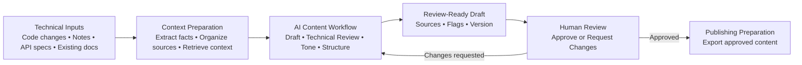
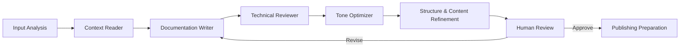
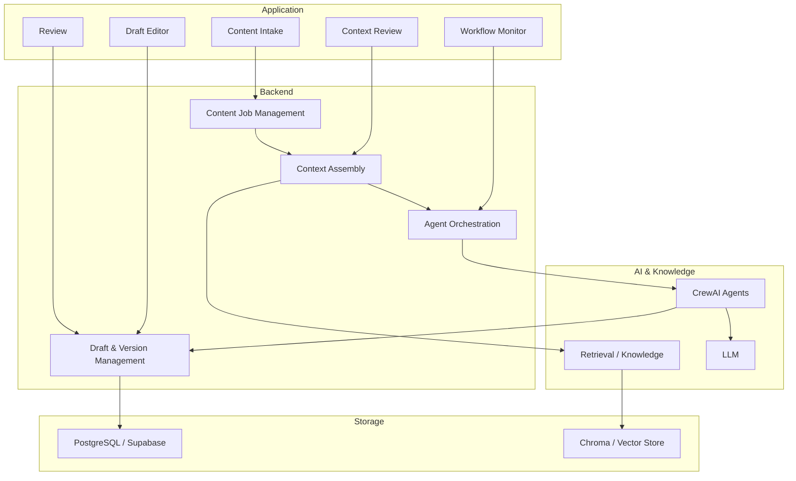
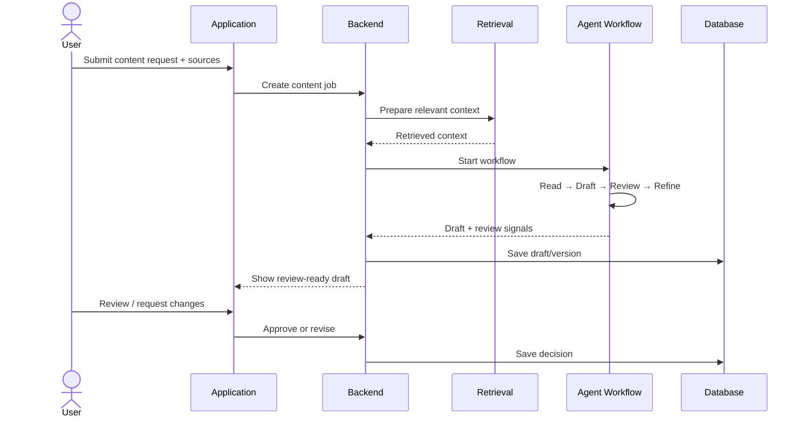

# gitlab-ai-content-engine
AI-powered multi-agent engine that transforms technical changes, code diffs, and product context into source-grounded, review-ready documentation and content.
# GitLab AI Content & Documentation Engine

> Turn technical changes into source-grounded, review-ready documentation with a multi-agent AI workflow.

## Overview

The **GitLab AI Content & Documentation Engine** helps teams transform technical inputs such as code changes, release notes, API specifications, issue context, and existing documentation into structured content drafts.

Instead of asking one AI agent to generate everything at once, the system separates the work into focused stages:

**Context → Draft → Technical Review → Tone & Structure → Human Review → Publish**

The goal is simple: **reduce documentation effort without removing technical and editorial control.**

---

## Why this project?

Technical changes often arrive before their documentation is ready. Engineers may have the code change, product teams may have release context, and writers may have existing documentation — but that information is spread across different sources.

This project brings those inputs together and creates a controlled path from technical change to review-ready content.

### What it helps with

- Converting technical changes into documentation drafts
- Keeping generated content grounded in supplied source material
- Reusing relevant existing documentation and knowledge
- Separating technical validation from writing and tone refinement
- Keeping a human reviewer in the approval loop
- Maintaining draft/version context throughout the workflow

---

## How it works



### Typical input

A content request can combine:

- Code changes / diffs
- Release or product notes
- API specifications
- Issue or feature context
- Existing documentation
- Content type and audience requirements

### Typical output

Depending on the request, the workflow can prepare:

- Release notes
- Technical documentation
- Developer-facing blogs
- Onboarding content
- API documentation

---

## Multi-Agent Workflow

Each stage has a focused responsibility instead of relying on a single generation step.



| Stage | Responsibility |
|---|---|
| **Context Reader** | Understands the supplied material, extracts relevant facts, and identifies missing context. |
| **Documentation Writer** | Creates the first structured draft using the prepared context. |
| **Technical Reviewer** | Checks whether technical claims remain supported by the available source material. |
| **Tone Optimizer** | Adjusts language for the selected audience and content type. |
| **Refinement** | Improves structure, clarity, headings, examples, and overall readability. |
| **Human Review** | Final review and approval before publishing. |

---

## Architecture



### Architecture responsibilities

**Frontend / UI**
- Collects content requests and source files
- Displays context and workflow progress
- Provides the draft and review experience

**Backend**
- Handles content jobs and inputs
- Builds the context package
- Coordinates the agent workflow
- Stores draft/version information

**AI layer**
- Runs specialized content agents
- Uses retrieved context when relevant
- Produces structured intermediate and final outputs

**Knowledge / Retrieval**
- Makes existing documentation, terminology, examples, and other approved context searchable

**Database**
- Stores operational records such as jobs, drafts, sources, review information, and workflow state

---

## Tech Stack

| Layer | Technology |
|---|---|
| **Backend API** | FastAPI |
| **AI Orchestration** | CrewAI |
| **LLM** | Gemini |
| **Retrieval / Vector Store** | Chroma |
| **Operational Database** | PostgreSQL / Supabase |
| **ORM / Database Access** | SQLAlchemy |
| **Configuration** | Python `.env` configuration |
| **Frontend** | Project web interface |

> The exact frontend/deployment configuration can vary with the environment. Backend and AI components above reflect the project's implementation direction.

---

## Project Structure

```text
gitlab-ai-content-engine/
│
├── frontend/
│   └── ...                 # Web application
│
├── backend/
│   ├── agents/             # CrewAI agents and workflow
│   ├── retrieval/          # Context and vector retrieval
│   ├── api/                # Backend endpoints
│   ├── database/           # Database models / access
│   └── ...
│
├── data/                   # Local/sample content where applicable
├── docs/                   # Project documentation and README assets
├── tests/                  # Tests
├── .env.example            # Environment variable template
└── README.md
```

---

## Getting Started

### 1. Clone the repository

```bash
git clone <repository-url>
cd gitlab-ai-content-engine
```

### 2. Create the environment

Create and activate a Python virtual environment for the backend.

```bash
python3 -m venv .venv
source .venv/bin/activate
```

### 3. Install backend dependencies

```bash
pip install -r backend/requirements.txt
```

### 4. Configure environment variables

Create a `.env` file from the provided example:

```bash
cp .env.example .env
```

Add the required values for the project's LLM and database configuration.

**Do not commit `.env` or API keys to GitHub.**

### 5. Start the application

Start the backend and frontend using the project's configured development commands.

> Keep the actual commands for each service in the project-specific setup documentation if the frontend/backend run independently.

---

## Configuration

The application uses environment variables for credentials and service configuration.

Typical configuration includes:

```text
GEMINI_API_KEY
GOOGLE_API_KEY
DATABASE_URL
```

The real values belong only in `.env`.

---

## Core Workflow in the Application



---

## Source Grounding & Human Review

A central design principle is that generated content should remain connected to the supplied technical context.

The workflow therefore separates:

**source/context preparation → generation → technical checking → refinement → human approval**

This helps reduce unsupported claims and makes it easier for a reviewer to understand where the generated content came from.

AI generation is not treated as the final publishing decision.

---

## Example Use Case

### From code change to release documentation

```text
Code change / release context
            ↓
      Context preparation
            ↓
       Draft generation
            ↓
     Technical validation
            ↓
      Tone / structure
            ↓
        Human review
            ↓
      Approved content
```

A team can therefore start with technical information that already exists and use the engine to prepare a documentation draft rather than writing the entire document manually from scratch.

---

## Development Notes

The project is organized around a clear separation of responsibilities:

- **Frontend** handles the user experience.
- **Backend** manages requests, data, and orchestration.
- **Agents** handle specialized content tasks.
- **Retrieval** supplies relevant existing knowledge.
- **Database** stores application state and versions.
- **Human review** controls the final approval step.

This separation makes the workflow easier to test, debug, and extend.

---

## Security

Never commit:

- API keys
- Database passwords
- Repository access tokens
- Private credentials
- Production `.env` files

Use environment variables and keep secrets on the server side.

---

## Status

🚧 **Active development**

The project is being developed as a multi-agent AI documentation workflow with source ingestion, retrieval, content generation, technical review, refinement, and human approval.

---

<p align="center">

**Technical Change → Context → AI Workflow → Human Review → Documentation**

</p>
