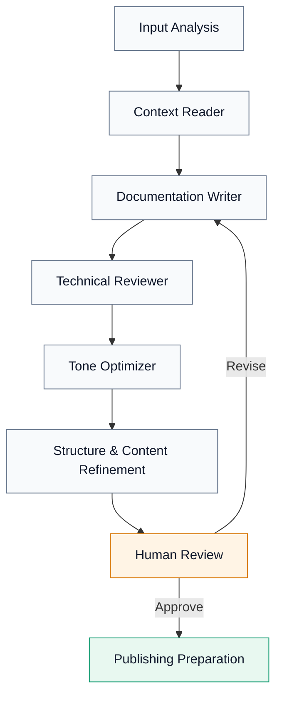
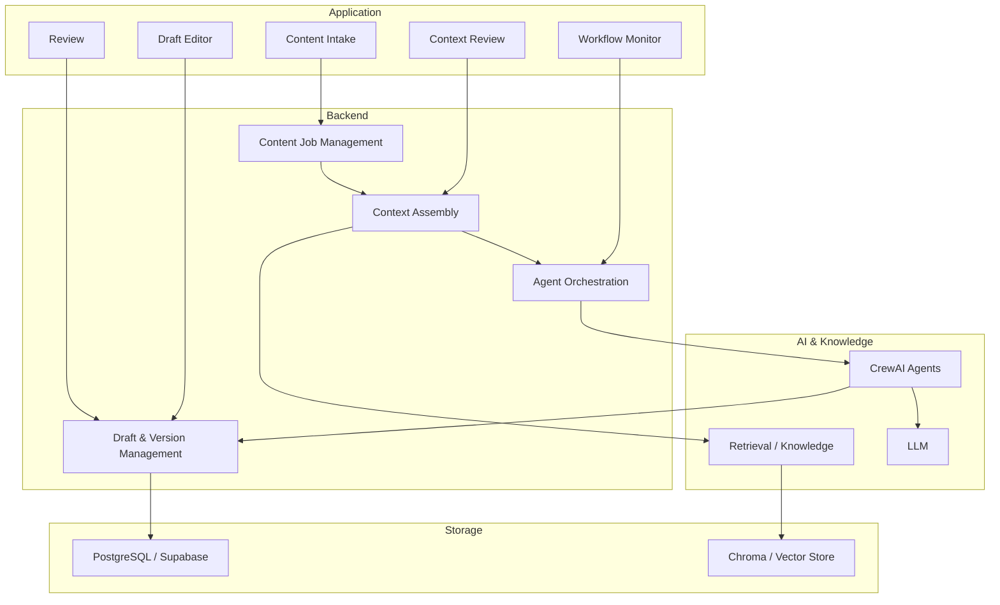
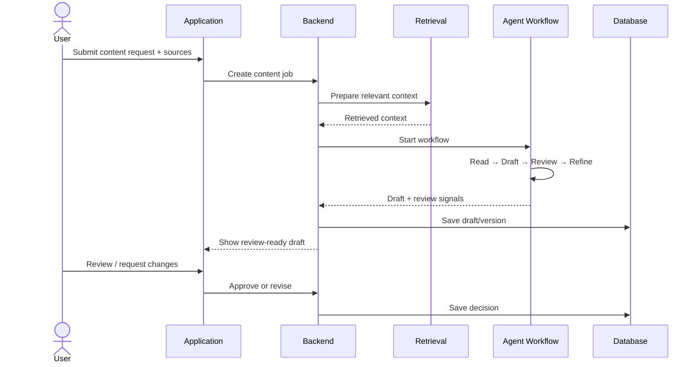
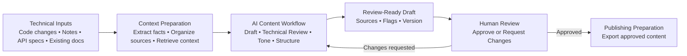
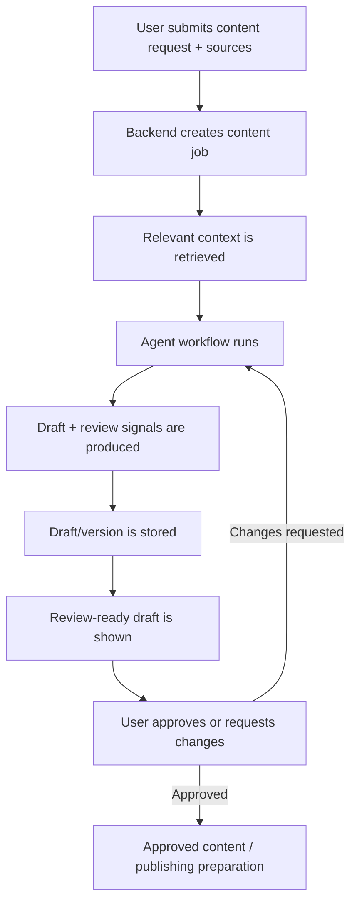

# GitLab AI Content & Documentation Engine

> Turn technical changes into source-grounded, review-ready documentation with a multi-agent AI workflow.

## Overview

The **GitLab AI Content & Documentation Engine** helps teams transform technical inputs such as code changes, release notes, API specifications, issue context, and existing documentation into structured content drafts.

Instead of asking one AI agent to generate everything at once, the system separates the work into focused stages:

**Context → Draft → Technical Review → Tone & Structure → Human Review → Publish**

The goal is simple: **reduce documentation effort without removing technical and editorial control.**

---

## Why this project?

Technical changes often arrive before their documentation is ready. Engineers may have the code change, product teams may have release context, and writers may have existing documentation — but that information is spread across different sources.

This project brings those inputs together and creates a controlled path from technical change to review-ready content.

### What it helps with

- Converting technical changes into documentation drafts
- Keeping generated content grounded in supplied source material
- Reusing relevant existing documentation and knowledge
- Separating technical validation from writing and tone refinement
- Keeping a human reviewer in the approval loop
- Maintaining draft/version context throughout the workflow

---

## How it works

```
flowchart LR
    A["Technical Inputs<br/>Code changes • Notes • API specs • Existing docs"]
    B["Context Preparation<br/>Extract facts • Organize sources • Retrieve context"]
    C["AI Content Workflow<br/>Draft • Technical Review • Tone • Structure"]
    D["Review-Ready Draft<br/>Sources • Flags • Version"]
    E["Human Review<br/>Approve or Request Changes"]
    F["Publishing Preparation<br/>Export approved content"]

    A --> B --> C --> D --> E
    E -->|Changes requested| C
    E -->|Approved| F
```

### Typical input

A content request can combine:

- Code changes / diffs
- Release or product notes
- API specifications
- Issue or feature context
- Existing documentation
- Content type and audience requirements

### Typical output

Depending on the request, the workflow can prepare:

- Release notes
- Technical documentation
- Developer-facing blogs
- Onboarding content
- API documentation

---

## Multi-Agent Workflow

Each stage has a focused responsibility instead of relying on a single generation step.



| Stage | Responsibility |
|---|---|
| **Context Reader** | Understands the supplied material, extracts relevant facts, and identifies missing context. |
| **Documentation Writer** | Creates the first structured draft using the prepared context. |
| **Technical Reviewer** | Checks whether technical claims remain supported by the available source material. |
| **Tone Optimizer** | Adjusts language for the selected audience and content type. |
| **Refinement** | Improves structure, clarity, headings, examples, and overall readability. |
| **Human Review** | Final review and approval before publishing. |

---

## Architecture



### Architecture responsibilities

**Frontend / UI**
- Collects content requests and source files
- Displays context and workflow progress
- Provides the draft and review experience

**Backend**
- Handles content jobs and inputs
- Builds the context package
- Coordinates the agent workflow
- Stores draft/version information

**AI layer**
- Runs specialized content agents
- Uses retrieved context when relevant
- Produces structured intermediate and final outputs

**Knowledge / Retrieval**
- Makes existing documentation, terminology, examples, and other approved context searchable

**Database**
- Stores operational records such as jobs, drafts, sources, review information, and workflow state

---

## Tech Stack

| Layer | Technology |
|---|---|
| **Backend API** | FastAPI |
| **AI Orchestration** | CrewAI |
| **LLM** | Gemini |
| **Retrieval / Vector Store** | Chroma |
| **Operational Database** | PostgreSQL / Supabase |
| **ORM / Database Access** | SQLAlchemy |
| **Configuration** | Python `.env` configuration |
| **Frontend** | Project web interface |

> The exact frontend/deployment configuration can vary with the environment. Backend and AI components above reflect the project's implementation direction.

---

## Project Structure

The repository is organized around the major application responsibilities rather than placing the entire workflow in a single module.

```text
gitlab-ai-content-engine/
│
├── backend/
│   ├── agents/
│   │   └── crew.py              # Multi-agent workflow
│   ├── retrieval/
│   │   └── chroma_store.py      # Vector retrieval
│   ├── auth/                    # Authentication-related logic
│   ├── database/                # Database configuration / models
│   ├── services/                # Application services
│   ├── chroma_data/             # Retrieval data where used
│   ├── main.py                  # FastAPI application entry point
│   ├── models.py                # Application models
│   └── requirements.txt         # Backend dependencies
│
├── frontend/
│   └── ...                      # Web application
│
├── data/
│   ├── sample_inputs/           # Example technical inputs
│   ├── sample_docs/             # Example documentation
│   ├── style_guides/            # Writing/style context
│   └── content_templates/       # Content templates
│
├── tests/
│   ├── functional_tests/
│   ├── ai_output_tests/
│   └── edge_cases/
│
├── docs/
│   └── readme_assets/            # README diagrams
│
├── .env.example
└── README.md
```

> Folder names can vary slightly with the current implementation; the structure above reflects the main responsibilities of the project.

---

## Getting Started

### 1. Clone the repository

```bash
git clone <repository-url>
cd gitlab-ai-content-engine
```

### 2. Create the environment

Create and activate a Python virtual environment for the backend.

```bash
python3 -m venv .venv
source .venv/bin/activate
```

### 3. Install backend dependencies

```bash
pip install -r backend/requirements.txt
```

### 4. Configure environment variables

Create a `.env` file from the provided example:

```bash
cp .env.example .env
```

Add the required values for the project's LLM and database configuration.

**Do not commit `.env` or API keys to GitHub.**

### 5. Start the application

Start the backend and frontend using the project's configured development commands.

> Keep the actual commands for each service in the project-specific setup documentation if the frontend/backend run independently.

---

## Configuration

Create a local `.env` file using `.env.example`.

| Variable | Purpose |
|---|---|
| `GEMINI_API_KEY` | Gemini API key used by the AI workflow |
| `GOOGLE_API_KEY` | Google API key where required by the configured AI services |
| `DATABASE_URL` | PostgreSQL / Supabase connection URL |
| `GITLAB_URL` | GitLab instance URL, for example `https://gitlab.com` |
| `GITLAB_TOKEN` | GitLab personal/project access token used for GitLab API access |
| `SMTP_HOST` | SMTP server hostname used for email delivery |
| `SMTP_PORT` | SMTP server port |
| `SMTP_USERNAME` | SMTP account username |
| `SMTP_PASSWORD` | SMTP account/app password |
| `SMTP_FROM` | Sender address used for application emails |

### Security

Keep real credentials only in `.env` or the deployment platform's secret manager.

**Never commit:**

- API keys
- Database passwords
- GitLab tokens
- SMTP passwords
- Production `.env` files

The `.env.example` file should contain variable names and safe placeholders only.

---

## Core Workflow in the Application



---

## Source Grounding & Human Review

A central design principle is that generated content should remain connected to the supplied technical context.

The workflow therefore separates:

**source/context preparation → generation → technical checking → refinement → human approval**

This helps reduce unsupported claims and makes it easier for a reviewer to understand where the generated content came from.

AI generation is not treated as the final publishing decision.

---

## Example Use Case

### From code change to release documentation

```text
Code change / release context
            ↓
      Context preparation
            ↓
       Draft generation
            ↓
     Technical validation
            ↓
      Tone / structure
            ↓
        Human review
            ↓
      Approved content
```

A team can therefore start with technical information that already exists and use the engine to prepare a documentation draft rather than writing the entire document manually from scratch.

---

## Development Notes

The project is organized around a clear separation of responsibilities:

- **Frontend** handles the user experience.
- **Backend** manages requests, data, and orchestration.
- **Agents** handle specialized content tasks.
- **Retrieval** supplies relevant existing knowledge.
- **Database** stores application state and versions.
- **Human review** controls the final approval step.

This separation makes the workflow easier to test, debug, and extend.

---

## Project Status

🚧 **Active development**

The project is being developed as a multi-agent AI documentation workflow with source ingestion, retrieval, content generation, technical review, refinement, and human approval.

---

<p align="center">
  <strong>Technical Change → Context → AI Workflow → Human Review → Documentation</strong>
</p>


# GitLab AI Content & Documentation Engine

> Turn technical changes into source-grounded, review-ready documentation with a multi-agent AI workflow.

## Overview

The **GitLab AI Content & Documentation Engine** helps teams transform technical inputs such as code changes, release notes, API specifications, issue context, and existing documentation into structured content drafts.

Instead of asking one AI agent to generate everything at once, the system separates the work into focused stages:

**Context → Draft → Technical Review → Tone & Structure → Human Review → Publish**

The goal is simple: **reduce documentation effort without removing technical and editorial control.**

---

## Why this project?

Technical changes often arrive before their documentation is ready. Engineers may have the code change, product teams may have release context, and writers may have existing documentation — but that information is spread across different sources.

This project brings those inputs together and creates a controlled path from technical change to review-ready content.

### What it helps with

- Converting technical changes into documentation drafts
- Keeping generated content grounded in supplied source material
- Reusing relevant existing documentation and knowledge
- Separating technical validation from writing and tone refinement
- Keeping a human reviewer in the approval loop
- Maintaining draft/version context throughout the workflow

---

## How it works



### Typical input

A content request can combine:

- Code changes / diffs
- Release or product notes
- API specifications
- Issue or feature context
- Existing documentation
- Content type and audience requirements

### Typical output

Depending on the request, the workflow can prepare:

- Release notes
- Technical documentation
- Developer-facing blogs
- Onboarding content
- API documentation

---

## Multi-Agent Workflow

Each stage has a focused responsibility instead of relying on a single generation step.


| Stage | Responsibility |
|---|---|
| **Context Reader** | Understands the supplied material, extracts relevant facts, and identifies missing context. |
| **Documentation Writer** | Creates the first structured draft using the prepared context. |
| **Technical Reviewer** | Checks whether technical claims remain supported by the available source material. |
| **Tone Optimizer** | Adjusts language for the selected audience and content type. |
| **Refinement** | Improves structure, clarity, headings, examples, and overall readability. |
| **Human Review** | Final review and approval before publishing. |

---

## Architecture


### Architecture responsibilities

**Frontend / UI**
- Collects content requests and source files
- Displays context and workflow progress
- Provides the draft and review experience

**Backend**
- Handles content jobs and inputs
- Builds the context package
- Coordinates the agent workflow
- Stores draft/version information

**AI layer**
- Runs specialized content agents
- Uses retrieved context when relevant
- Produces structured intermediate and final outputs

**Knowledge / Retrieval**
- Makes existing documentation, terminology, examples, and other approved context searchable

**Database**
- Stores operational records such as jobs, drafts, sources, review information, and workflow state

---

## Tech Stack

| Layer | Technology |
|---|---|
| **Backend API** | FastAPI |
| **AI Orchestration** | CrewAI |
| **LLM** | Gemini |
| **Retrieval / Vector Store** | Chroma |
| **Operational Database** | PostgreSQL / Supabase |
| **ORM / Database Access** | SQLAlchemy |
| **Configuration** | Python `.env` configuration |
| **Frontend** | Project web interface |

> The exact frontend/deployment configuration can vary with the environment. Backend and AI components above reflect the project's implementation direction.

---

## Project Structure

```text
gitlab-ai-content-engine/
│
├── frontend/
│   └── ...                 # Web application
│
├── backend/
│   ├── agents/             # CrewAI agents and workflow
│   ├── retrieval/          # Context and vector retrieval
│   ├── api/                # Backend endpoints
│   ├── database/           # Database models / access
│   └── ...
│
├── data/                   # Local/sample content where applicable
├── docs/                   # Project documentation and README assets
├── tests/                  # Tests
├── .env.example            # Environment variable template
└── README.md
```

---

## Getting Started

### 1. Clone the repository

```bash
git clone <repository-url>
cd gitlab-ai-content-engine
```

### 2. Create the environment

Create and activate a Python virtual environment for the backend.

```bash
python3 -m venv .venv
source .venv/bin/activate
```

### 3. Install backend dependencies

```bash
pip install -r backend/requirements.txt
```

### 4. Configure environment variables

Create a `.env` file from the provided example:

```bash
cp .env.example .env
```

Add the required values for the project's LLM and database configuration.

**Do not commit `.env` or API keys to GitHub.**

### 5. Start the application

Start the backend and frontend using the project's configured development commands.

> Keep the actual commands for each service in the project-specific setup documentation if the frontend/backend run independently.

---

## Configuration

The application uses environment variables for credentials and service configuration.

Typical configuration includes:

```text
GEMINI_API_KEY
GOOGLE_API_KEY
DATABASE_URL
```

The real values belong only in `.env`.

---

## Core Workflow in the Application



---

## Source Grounding & Human Review

A central design principle is that generated content should remain connected to the supplied technical context.

The workflow therefore separates:

**source/context preparation → generation → technical checking → refinement → human approval**

This helps reduce unsupported claims and makes it easier for a reviewer to understand where the generated content came from.

AI generation is not treated as the final publishing decision.

---

## Example Use Case

### From code change to release documentation

```text
Code change / release context
            ↓
      Context preparation
            ↓
       Draft generation
            ↓
     Technical validation
            ↓
      Tone / structure
            ↓
        Human review
            ↓
      Approved content
```

A team can therefore start with technical information that already exists and use the engine to prepare a documentation draft rather than writing the entire document manually from scratch.

---

## Development Notes

The project is organized around a clear separation of responsibilities:

- **Frontend** handles the user experience.
- **Backend** manages requests, data, and orchestration.
- **Agents** handle specialized content tasks.
- **Retrieval** supplies relevant existing knowledge.
- **Database** stores application state and versions.
- **Human review** controls the final approval step.

This separation makes the workflow easier to test, debug, and extend.

---

## Security

Never commit:

- API keys
- Database passwords
- Repository access tokens
- Private credentials
- Production `.env` files

Use environment variables and keep secrets on the server side.

---

## Status

🚧 **Active development**

The project is being developed as a multi-agent AI documentation workflow with source ingestion, retrieval, content generation, technical review, refinement, and human approval.

---

<p align="center">

**Technical Change → Context → AI Workflow → Human Review → Documentation**

</p>


# GitLab AI Content & Documentation Engine

> **Turn technical changes into source-grounded, review-ready content through a multi-agent AI workflow.**

<p align="center">
  
</p>

## Overview

The **GitLab AI Content & Documentation Engine** helps transform technical inputs such as code changes, release notes, API specifications, issue context, and existing documentation into structured content drafts.

Instead of asking one AI model to perform the entire task at once, the project separates the workflow into focused stages for **context understanding, drafting, technical review, tone refinement, content refinement, and human approval**.

The goal is to reduce the effort required to create technical content while keeping the result **grounded in available source material and subject to human review**.

### What it helps with

- Turning technical changes into documentation drafts
- Reusing relevant existing documentation and knowledge
- Separating writing from technical validation
- Adapting content for different audiences and content types
- Keeping human review in the publishing path
- Maintaining draft and version context

---

## How It Works

<p align="center">
  
</p>

The workflow starts with technical information and ends with content that is ready for human approval and the next publishing step.

### Typical inputs

- Code changes or diffs
- Release and product notes
- API specifications
- Issue or feature context
- Existing documentation
- Content type and audience requirements

### Typical outputs

- Release notes
- Technical documentation
- Developer-facing content
- Onboarding content
- API documentation

---

## Multi-Agent Workflow

<p align="center">
  
</p>

Each stage has a focused responsibility:

| Stage | Responsibility |
|---|---|
| **Input Analysis** | Understand the request, audience, and technical change. |
| **Context Reader** | Extract relevant facts and prepare working context. |
| **Documentation Writer** | Create the initial structured draft. |
| **Technical Reviewer** | Check technical accuracy and identify unsupported or missing information. |
| **Tone Optimizer** | Adapt language, clarity, and style for the target content type. |
| **Content Refinement** | Improve structure, headings, flow, and readability. |
| **Human Review** | Provide the final editorial and technical approval. |
| **Publishing Preparation** | Prepare approved content and metadata for the next publishing step. |

---

## Technical Architecture

<p align="center">
  
</p>

### Main components

**Frontend**
- Content intake
- Context view
- Draft editor
- Review interface
- Workflow/dashboard views

**Backend**
- Content-job management
- Input handling
- Context assembly
- Agent orchestration
- Draft/version management
- Review state

**AI layer**
- CrewAI agent workflow
- Gemini-powered generation and refinement
- Structured agent responsibilities

**Retrieval layer**
- Searchable project knowledge
- Existing documentation and content context
- Relevant context supplied to the AI workflow

**Data layer**
- PostgreSQL / Supabase for application data
- ChromaDB for vector-based retrieval
- GitLab API for repository and engineering context

---

## Context & Knowledge Retrieval

<p align="center">
  
</p>

Retrieval is used to provide the AI workflow with relevant existing knowledge instead of relying only on the current request.

The general flow is:

**Ingest → Prepare → Store → Retrieve → Validate → Build Context Pack**

This helps the generation workflow use existing terminology, documentation, examples, and other relevant project knowledge.

---

## Example Use Case

### From a GitLab code change to release documentation

Consider a developer merging a feature that changes an existing product behavior.

```text
1. Code change
   Developer merges or provides the technical change.

        ↓

2. Context collection
   The application gathers the change and related
   notes, API details, issues, or existing documentation.

        ↓

3. Draft generation
   The AI workflow creates an initial release/documentation draft.

        ↓

4. Technical validation
   The technical-review stage checks facts, missing information,
   and potentially unsupported claims.

        ↓

5. Tone & structure
   The content is refined for the selected audience and format.

        ↓

6. Human review
   A writer, engineer, or domain reviewer checks the draft.

        ↓

7. Approval
   The reviewer accepts the content or sends it back for revision.

        ↓

8. Publishing preparation
   The approved content is prepared for export or the next
   documentation/publishing workflow.
```

### Why this is useful

Without the engine, the writer may need to collect information from several places before starting the document.

With the engine, the technical context is brought together first, then passed through specialized AI stages before the writer or reviewer makes the final decision.

---

## Tech Stack

| Layer | Technology | Purpose |
|---|---|---|
| **Backend API** | FastAPI | API endpoints, orchestration, and application services |
| **AI Orchestration** | CrewAI | Coordinates specialized content agents |
| **LLM** | Gemini | Generation, analysis, review, and refinement |
| **Retrieval** | ChromaDB | Semantic retrieval of relevant knowledge |
| **Database** | PostgreSQL / Supabase | Application and workflow data |
| **Database Access** | SQLAlchemy | Python database access |
| **GitLab Integration** | GitLab API | Repository and engineering context |
| **Frontend** | Project web interface | User interaction, content workflow, and review |

---

## Project Structure

The repository is organized around the major application responsibilities rather than placing the entire workflow in a single module.

```text
gitlab-ai-content-engine/
│
├── backend/
│   ├── agents/
│   │   └── crew.py              # Multi-agent workflow
│   ├── retrieval/
│   │   └── chroma_store.py      # Vector retrieval
│   ├── auth/                    # Authentication-related logic
│   ├── database/                # Database configuration / models
│   ├── services/                # Application services
│   ├── chroma_data/             # Retrieval data where used
│   ├── main.py                  # FastAPI application entry point
│   ├── models.py                # Application models
│   └── requirements.txt         # Backend dependencies
│
├── frontend/
│   └── ...                      # Web application
│
├── data/
│   ├── sample_inputs/           # Example technical inputs
│   ├── sample_docs/             # Example documentation
│   ├── style_guides/            # Writing/style context
│   └── content_templates/       # Content templates
│
├── tests/
│   ├── functional_tests/
│   ├── ai_output_tests/
│   └── edge_cases/
│
├── docs/
│   └── readme_assets/            # README diagrams
│
├── .env.example
└── README.md
```

> Folder names can vary slightly with the current implementation; the structure above reflects the main responsibilities of the project.

---

## Getting Started

### 1. Clone the repository

```bash
git clone <repository-url>
cd gitlab-ai-content-engine
```

### 2. Create the Python environment

```bash
python3 -m venv .venv
source .venv/bin/activate
```

### 3. Install backend dependencies

```bash
pip install -r backend/requirements.txt
```

### 4. Configure environment variables

Create the local environment file from the provided template:

```bash
cp .env.example .env
```

Add the required service credentials and connection values.

### 5. Run the application

Start the backend and frontend using the development commands defined by the project.

---

## Configuration

Create a local `.env` file using `.env.example`.

| Variable | Purpose |
|---|---|
| `GEMINI_API_KEY` | Gemini API key used by the AI workflow |
| `GOOGLE_API_KEY` | Google API key where required by the configured AI services |
| `DATABASE_URL` | PostgreSQL / Supabase connection URL |
| `GITLAB_URL` | GitLab instance URL, for example `https://gitlab.com` |
| `GITLAB_TOKEN` | GitLab personal/project access token used for GitLab API access |
| `SMTP_HOST` | SMTP server hostname used for email delivery |
| `SMTP_PORT` | SMTP server port |
| `SMTP_USERNAME` | SMTP account username |
| `SMTP_PASSWORD` | SMTP account/app password |
| `SMTP_FROM` | Sender address used for application emails |

### Security

Keep real credentials only in `.env` or the deployment platform's secret manager.

**Never commit:**

- API keys
- Database passwords
- GitLab tokens
- SMTP passwords
- Production `.env` files

The `.env.example` file should contain variable names and safe placeholders only.

---

## Core Application Flow

```text
User
  │
  ▼
Content Request
  │
  ├── Technical input
  ├── Existing documentation
  └── Content requirements
  │
  ▼
Context Preparation
  │
  ▼
Multi-Agent Workflow
  │
  ├── Read context
  ├── Draft
  ├── Technical review
  ├── Refine tone
  └── Improve structure
  │
  ▼
Review-Ready Draft
  │
  ▼
Human Review
  │
  ├── Revise ───────► AI Workflow
  │
  └── Approve
        │
        ▼
  Publishing Preparation
```

---

## Source Grounding & Human Review

A central design principle is that generated content should remain connected to the technical context available to the system.

The workflow therefore separates:

**context preparation → generation → technical checking → refinement → human approval**

This provides a clear place to identify missing information and questionable claims before content is approved.

AI generation is therefore treated as an **assistive step**, not the final publishing decision.

---

## Development Notes

The project separates responsibilities so individual parts can be developed and tested independently:

- **Frontend** — user interaction and content workflow
- **Backend** — API, application state, and orchestration
- **Agents** — specialized AI responsibilities
- **Retrieval** — relevant knowledge and context
- **Database** — persistent application data
- **GitLab integration** — technical repository context
- **Human review** — final quality and approval step

This separation also makes it easier to extend the workflow with additional content types, knowledge sources, review stages, and publishing integrations.

---

## Project Status

🚧 **Active Development**

The current project focuses on the core AI documentation workflow: source/context handling, multi-agent generation and review, retrieval, human approval, and application integration.

---

<p align="center">
  <strong>Technical Change → Context → AI Workflow → Human Review → Documentation</strong>
</p>


# GitLab AI Content & Documentation Engine

> Turn technical changes into source-grounded, review-ready documentation with a multi-agent AI workflow.

## Overview

The **GitLab AI Content & Documentation Engine** helps teams transform technical inputs such as code changes, release notes, API specifications, issue context, and existing documentation into structured content drafts.

Instead of asking one AI agent to generate everything at once, the system separates the work into focused stages:

**Context → Draft → Technical Review → Tone & Structure → Human Review → Publish**

The goal is simple: **reduce documentation effort without removing technical and editorial control.**

---

## Why this project?

Technical changes often arrive before their documentation is ready. Engineers may have the code change, product teams may have release context, and writers may have existing documentation — but that information is spread across different sources.

This project brings those inputs together and creates a controlled path from technical change to review-ready content.

### What it helps with

- Converting technical changes into documentation drafts
- Keeping generated content grounded in supplied source material
- Reusing relevant existing documentation and knowledge
- Separating technical validation from writing and tone refinement
- Keeping a human reviewer in the approval loop
- Maintaining draft/version context throughout the workflow

---

## How it works


### Typical input

A content request can combine:

- Code changes / diffs
- Release or product notes
- API specifications
- Issue or feature context
- Existing documentation
- Content type and audience requirements

### Typical output

Depending on the request, the workflow can prepare:

- Release notes
- Technical documentation
- Developer-facing blogs
- Onboarding content
- API documentation

---

## Multi-Agent Workflow

Each stage has a focused responsibility instead of relying on a single generation step.

<p align="center"></p>

| Stage | Responsibility |
|---|---|
| **Context Reader** | Understands the supplied material, extracts relevant facts, and identifies missing context. |
| **Documentation Writer** | Creates the first structured draft using the prepared context. |
| **Technical Reviewer** | Checks whether technical claims remain supported by the available source material. |
| **Tone Optimizer** | Adjusts language for the selected audience and content type. |
| **Refinement** | Improves structure, clarity, headings, examples, and overall readability. |
| **Human Review** | Final review and approval before publishing. |

---

## Architecture


### Architecture responsibilities

**Frontend / UI**
- Collects content requests and source files
- Displays context and workflow progress
- Provides the draft and review experience

**Backend**
- Handles content jobs and inputs
- Builds the context package
- Coordinates the agent workflow
- Stores draft/version information

**AI layer**
- Runs specialized content agents
- Uses retrieved context when relevant
- Produces structured intermediate and final outputs

**Knowledge / Retrieval**
- Makes existing documentation, terminology, examples, and other approved context searchable

**Database**
- Stores operational records such as jobs, drafts, sources, review information, and workflow state

---

## Tech Stack

| Layer | Technology |
|---|---|
| **Backend API** | FastAPI |
| **AI Orchestration** | CrewAI |
| **LLM** | Gemini |
| **Retrieval / Vector Store** | Chroma |
| **Operational Database** | PostgreSQL / Supabase |
| **ORM / Database Access** | SQLAlchemy |
| **Configuration** | Python `.env` configuration |
| **Frontend** | Project web interface |

> The exact frontend/deployment configuration can vary with the environment. Backend and AI components above reflect the project's implementation direction.

---

## Project Structure

```text
gitlab-ai-content-engine/
│
├── frontend/
│   └── ...                 # Web application
│
├── backend/
│   ├── agents/             # CrewAI agents and workflow
│   ├── retrieval/          # Context and vector retrieval
│   ├── api/                # Backend endpoints
│   ├── database/           # Database models / access
│   └── ...
│
├── data/                   # Local/sample content where applicable
├── docs/                   # Project documentation and README assets
├── tests/                  # Tests
├── .env.example            # Environment variable template
└── README.md
```

---

## Getting Started

### 1. Clone the repository

```bash
git clone <repository-url>
cd gitlab-ai-content-engine
```

### 2. Create the environment

Create and activate a Python virtual environment for the backend.

```bash
python3 -m venv .venv
source .venv/bin/activate
```

### 3. Install backend dependencies

```bash
pip install -r backend/requirements.txt
```

### 4. Configure environment variables

Create a `.env` file from the provided example:

```bash
cp .env.example .env
```

Add the required values for the project's LLM and database configuration.

**Do not commit `.env` or API keys to GitHub.**

### 5. Start the application

Start the backend and frontend using the project's configured development commands.

> Keep the actual commands for each service in the project-specific setup documentation if the frontend/backend run independently.

---

## Configuration

The application uses environment variables for external services and credentials.

Create `.env` from `.env.example` and configure the values required by the environment:

```env
GITLAB_URL=https://gitlab.com/api/v4
GITLAB_TOKEN=

SMTP_HOST=smtp.gmail.com
SMTP_PORT=587
SMTP_USERNAME=
SMTP_PASSWORD=
SMTP_FROM=

GEMINI_API_KEY=
GOOGLE_API_KEY=
DATABASE_URL=
```

- `GITLAB_TOKEN` is used for authenticated GitLab API access.
- `SMTP_USERNAME`, `SMTP_PASSWORD`, and `SMTP_FROM` are used for email delivery.
- Keep all secret values in `.env` and never commit them to GitHub.
- `GITLAB_URL` can remain `https://gitlab.com/api/v4` for GitLab.com unless the project is configured for another GitLab instance.
---

## Core Workflow in the Application


---

## Source Grounding & Human Review

A central design principle is that generated content should remain connected to the supplied technical context.

The workflow therefore separates:

**source/context preparation → generation → technical checking → refinement → human approval**

This helps reduce unsupported claims and makes it easier for a reviewer to understand where the generated content came from.

AI generation is not treated as the final publishing decision.

---

## Example Use Case

### From code change to release documentation

```text
Code change / release context
            ↓
      Context preparation
            ↓
       Draft generation
            ↓
     Technical validation
            ↓
      Tone / structure
            ↓
        Human review
            ↓
      Approved content
```

A team can therefore start with technical information that already exists and use the engine to prepare a documentation draft rather than writing the entire document manually from scratch.

---

## Development Notes

The project is organized around a clear separation of responsibilities:

- **Frontend** handles the user experience.
- **Backend** manages requests, data, and orchestration.
- **Agents** handle specialized content tasks.
- **Retrieval** supplies relevant existing knowledge.
- **Database** stores application state and versions.
- **Human review** controls the final approval step.

This separation makes the workflow easier to test, debug, and extend.

---

## Security

Never commit:

- API keys
- Database passwords
- Repository access tokens
- Private credentials
- Production `.env` files

Use environment variables and keep secrets on the server side.

---

## Status

🚧 **Active development**

The project is being developed as a multi-agent AI documentation workflow with source ingestion, retrieval, content generation, technical review, refinement, and human approval.

---

<p align="center">

**Technical Change → Context → AI Workflow → Human Review → Documentation**

</p>
